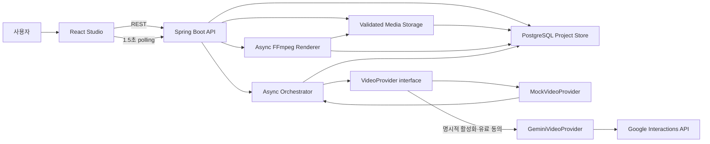

# FIRE 포트폴리오 기록

> 마지막 갱신: 2026-08-10
> 프로젝트: Frame Intelligence Rendering Engine
> 저장소: https://github.com/up-honey/AiAutoMvMaker
> 현재 단계: Mock 기본 파이프라인 + 선택적 Gemini Omni Flash 영상 생성 어댑터 + FFmpeg 최종 렌더 MVP

## 1. 프로젝트 소개

FIRE는 하나의 프롬프트로 영상 API를 호출하는 데서 끝나지 않고, 여러 장면의 생성 작업을 비동기로 실행하고 상태와 실패를 추적한 뒤 최종 영상으로 조립하기 위한 AI 영상 제작 파이프라인입니다.

현재 MVP의 목표는 실제 영상 생성 API에 비용을 쓰기 전에 다음 핵심 흐름을 검증하는 것입니다.

```text
영상 기획 입력 → 이미지·영상·음악 연결 → 비동기 작업 실행 → 장면별 상태 추적 → 결과 확인
```

## 2. 해결하려는 문제

AI 영상 제작은 장면 수가 늘어나면 단순 API 호출보다 작업 운영이 더 어려워집니다.

- 장면마다 처리 시간과 성공 여부가 다릅니다.
- 일부 장면 실패 때문에 전체 영상을 다시 만들면 시간과 비용이 낭비됩니다.
- 공급자별 API 형식에 서비스 로직이 결합되면 모델 교체가 어렵습니다.
- 서버 재시작, 중복 요청, 외부 API 장애에 대응할 작업 상태 관리가 필요합니다.
- 프롬프트, 모델, 입력 자산, 비용을 추적해야 결과를 재현하고 운영할 수 있습니다.

FIRE는 공급자 연동을 어댑터 뒤로 분리하고, 프로젝트와 장면의 상태 전이를 중심으로 이 문제를 해결하는 방향으로 설계했습니다.

## 3. 기술 스택

| 영역 | 기술 | 적용 내용 |
|---|---|---|
| Backend | Java 21, Spring Boot 4.1, Spring JDBC, Maven | REST API, 입력 검증, 비동기 작업 실행, 상태 관리 |
| Frontend | React 19, TypeScript 5.9, Vite 8 | 다중 미디어 선택, 사진 속도·분위기 프리셋, 렌더 상태·MP4 재생 UI |
| API | Spring Web MVC, Bean Validation | 구조화된 요청 검증과 오류 응답 |
| Data | PostgreSQL 17, H2(local default), Flyway, local media volume | 프로젝트·장면·입력 자산 메타데이터와 검증된 미디어 파일 저장 |
| Monitoring | Spring Boot Actuator | 애플리케이션 health/info 엔드포인트 |
| Test | JUnit 5, AssertJ | 도메인 상태 전이와 Mock 공급자 성공·실패 검증 |
| Runtime | Docker Compose, Docker, Nginx, FFmpeg/FFprobe | API·웹 분리와 고정 인자 기반 720p MP4 렌더링 |
| Version Control | Git, GitHub | `master` 베이스와 `new` 작업 브랜치 운영 |
| Video AI | Google Gemini Interactions API, Gemini Omni Flash preview | 조건부 텍스트·이미지·MP4→영상, 백그라운드 작업 폴링, 로컬 계약 테스트 |
| Planned | Redis/Queue, Object Storage | worker 분리, 운영 스토리지, 생성 시도·실비 정산 확장 예정 |

## 4. 현재 아키텍처



핵심 설계 결정은 다음과 같습니다.

- 실제 공급자와 무관한 `VideoProvider` 계약을 두어 서비스 흐름과 외부 API를 분리했습니다.
- 프로젝트는 `DRAFT → QUEUED → PROCESSING → COMPLETED/FAILED` 상태로 관리합니다.
- 각 장면도 `PENDING → PROCESSING → COMPLETED/FAILED` 상태를 독립적으로 가집니다.
- `MockVideoProvider`는 과금 없이 지연, 성공 결과, 결정적 실패(`[fail]`)를 재현합니다.
- API 오류는 HTTP 상태, 안전한 오류 코드, 메시지, 경로, 시각을 포함하는 구조로 반환합니다.
- Flyway가 PostgreSQL 스키마를 관리하고 모든 프로젝트·장면 상태 변경을 DB에 저장합니다.
- 업로드 파일은 시그니처·크기·장면 소유 관계·경로 포함 여부를 검증하고 UUID 저장 키와 SHA-256을 기록합니다.
- 장면 이미지·영상과 프로젝트 배경음악 메타데이터는 공급자 독립적인 생성 명령으로 전달됩니다.
- 한 장면의 여러 자산을 `timelinePosition`과 `durationMs`로 정렬하고 사진·동영상을 교차 전환합니다.
- 사용자 프롬프트는 FFmpeg에 전달하지 않고 선택된 프리셋만 고정 필터로 변환합니다.
- 렌더 작업도 독립 상태로 저장하며 재시작 시 중단된 작업을 다시 큐에 넣습니다.
- 서버 시작 시 중단된 작업을 찾아 완료 장면은 유지하고 미완료 장면부터 다시 실행합니다.
- 공급자 제출과 결과 대기를 분리하고 작업 ID를 먼저 저장해 재시작 시 기존 Gemini 작업을 폴링합니다.
- Gemini 모델명·10초 영상 출력 예상액·제출/완료 시각을 장면에 저장하고 생성 MP4를 브라우저에서 재생합니다.

## 5. 현재 구현 범위

### 구현 완료

- [x] 프로젝트 제목, 주제, 공통 스타일, 화면 비율, 장면 프롬프트 입력
- [x] 장면별 이미지·동영상 다중 선택과 프로젝트 배경음악 선택 UI
- [x] 흰색·하늘색 카드형 스튜디오와 모바일 단일 흐름·하단 CTA 반응형 UI
- [x] 단일 이미지·동영상 다중 업로드와 AI 생성·직접 업로드 배경음악 선택 UI
- [x] 선택 순서 기반 타임라인과 사진 초당 0.5~5장 노출 속도 조절
- [x] 최대 300개 시각 자산과 4개 병렬 업로드 worker
- [x] 로맨틱 웨딩·동화 테마파크·시네마틱·클린 렌더 프리셋
- [x] PNG/JPEG/WebP/GIF, MP4/WebM, MP3/WAV/OGG/M4A/AAC 업로드와 크기 제한
- [x] 파일 시그니처, 프로젝트·장면 소유권, 초안 상태, 경로 포함 검증
- [x] 원본 파일명과 분리된 UUID 저장 키, MIME, 크기, SHA-256 메타데이터 기록
- [x] 입력 자산 조회 API와 이미지·동영상 썸네일·오디오 재생 UI
- [x] 장면 소스와 배경음악을 `VideoProvider` 명령으로 전달
- [x] FFprobe 원본 동영상 길이 확인과 사진·영상 부드러운 교차 전환
- [x] 배경음악 반복·종료, 720p/30fps H.264/AAC MP4 비동기 렌더링
- [x] 최종 영상 상태 추적, 재시작 복구, 브라우저 재생·다운로드
- [x] 사용자 입력을 셸로 전달하지 않는 고정 `ProcessBuilder` 인자 구성
- [x] 한 프로젝트에 최대 12개 장면 등록 및 서버 입력 검증
- [x] 프로젝트 생성·목록·상세 조회 REST API
- [x] 사용 가능한 영상 공급자 목록 API
- [x] Mock 공급자를 이용한 비동기 장면 생성 시작
- [x] 조건부 Gemini Omni Flash 텍스트→영상·이미지→영상·MP4 편집 어댑터
- [x] Gemini 작업 ID 선저장, 백그라운드 폴링, 재시작 시 중복 제출 방지
- [x] 서버 활성화 2중 스위치와 요청별 유료 호출 확인 UI/API 게이트
- [x] Gemini API 키 헤더 전송, 안전한 오류 코드, 응답 원문 비노출
- [x] 생성 MP4 시그니처 검증·원자적 저장·장면별 브라우저 재생
- [x] 생성된 AI 장면을 업로드 원본보다 우선해 최종 FFmpeg MP4로 조립
- [x] 공급자 모델·10초 영상 출력 예상액·제출/완료 시각 영속화
- [x] 프로젝트와 장면의 상태 전이 및 중복 시작 방지
- [x] 알 수 없는 공급자, 잘못된 입력, 없는 프로젝트, 잘못된 상태의 구조화된 오류 처리
- [x] 공급자 성공 결과의 작업 ID와 미리보기 URI 기록
- [x] 공급자 실패 시 안전한 오류 코드 기록
- [x] 프로젝트 선택, 진행률, 장면별 상태를 보여주는 React UI
- [x] 1.5초 주기 polling을 통한 생성 상태 자동 갱신
- [x] 세로형 `9:16`과 가로형 `16:9` 프로젝트 지원
- [x] Actuator health/info 설정
- [x] PostgreSQL 기반 프로젝트·장면 영속화와 Flyway 마이그레이션
- [x] 조건부 DB 갱신을 통한 동시 중복 생성 요청 방지
- [x] 서버 시작 시 `QUEUED/PROCESSING` 작업 탐색 및 미완료 장면 복구
- [x] API·웹 Dockerfile, PostgreSQL image, Nginx, Docker Compose 구성
- [x] 외부 PostgreSQL 없이 기본 실행되는 H2 인메모리 로컬 구성
- [x] 도메인 상태 전이, Mock 공급자, 저장소, 복구 로직 테스트

### 아직 구현되지 않음

- [ ] 실제 Gemini 유료 계정으로 소액 end-to-end 생성 스모크 테스트
- [ ] Redis 또는 메시지 큐 기반 독립 worker
- [ ] 장면별 재시도 API와 부분 재생성
- [ ] 재시도 횟수, timeout, backoff, idempotency key
- [ ] 원본 동영상 음성과 배경음악 믹싱, 음성·자막 생성
- [ ] 운영용 object storage 및 미디어 보존·삭제 정책
- [ ] 사용자 인증·권한과 프로젝트 소유권 검증
- [ ] 공급자별 실제 비용 원장, 사용량 한도, 프로젝트 예산 차단
- [ ] 프런트엔드 자동화 테스트와 백엔드 API 통합 테스트
- [ ] CI/CD와 운영 환경 배포

`MockVideoProvider`는 입력 자산이 AI 공급자 계약까지 전달되는 흐름을 검증하고, 별도의 FFmpeg renderer가 업로드 자산을 실제 MP4로 합성합니다. 기본 로컬 H2 데이터는 프로세스 종료 시 사라지므로 영속성과 재시작 복구는 PostgreSQL 환경에서 검증해야 합니다.

## 6. 제공 API

| Method | Endpoint | 설명 |
|---|---|---|
| `POST` | `/api/projects` | 프로젝트와 장면 생성 |
| `GET` | `/api/projects` | 프로젝트 목록 조회 |
| `GET` | `/api/projects/{projectId}` | 프로젝트 및 장면 상태 조회 |
| `POST` | `/api/projects/{projectId}/assets` | 장면 이미지·영상 또는 프로젝트 배경음악 업로드 |
| `GET` | `/api/projects/{projectId}/assets/{assetId}/content` | 소유 프로젝트 범위 내 입력 미디어 조회 |
| `POST` | `/api/projects/{projectId}/render` | 비동기 최종 MP4 렌더링 시작 |
| `GET` | `/api/projects/{projectId}/render/content` | 완료된 최종 MP4 재생·다운로드 |
| `POST` | `/api/projects/{projectId}/generate?provider=mock` | 비동기 생성 시작 |
| `POST` | `/api/projects/{projectId}/generate?provider=gemini&confirmPaid=true` | 명시적으로 확인한 Gemini 유료 생성 시작 |
| `GET` | `/api/projects/{projectId}/scenes/{sceneId}/generated` | 완료된 공급자 생성 MP4 재생 |
| `GET` | `/api/providers` | 사용 가능한 공급자 조회 |
| `GET` | `/actuator/health` | 애플리케이션 상태 확인 |

## 7. 검증 결과

2026-08-10 기준 결과입니다.

| 검증 | 결과 | 확인 내용 |
|---|---|---|
| Backend Maven verify | 성공 | 43개 메인 소스 컴파일, JAR 패키징 성공 |
| Backend tests | 22/22 성공 | 상태·복구·파일 검증, Gemini 오프라인 HTTP 계약, 유료 확인·AI 장면 렌더 게이트, 실패 0 |
| H2 default smoke test | 성공 | PostgreSQL과 별도 프로필 없이 Flyway 적용, API 기동, health `200/UP` 확인 |
| Frontend production build | 성공 | TypeScript 검사 및 Vite 번들 생성 |
| API smoke test | 성공 | health `UP`, 프로젝트와 장면의 `COMPLETED` 전이 확인 |
| Browser workflow | 성공 | 프로젝트 생성 후 3개 장면이 100% 완료되는 흐름 확인 |
| Browser console | 성공 | 확인 당시 경고·오류 없음 |
| Secret check | 성공 | 회사 이메일, 토큰 패턴, `.env` 커밋 없음 |
| Docker Compose runtime | 미확인 | 이 PC의 Docker Linux engine 기동 문제로 전체 Compose 실행은 별도 확인 필요 |

주요 테스트 시나리오:

- 정상 상태 전이: `DRAFT → QUEUED → PROCESSING → COMPLETED`
- 이미 대기 중인 프로젝트의 중복 시작 거절
- Mock 공급자의 정상 작업 ID와 미리보기 URI 반환
- 프롬프트에 `[fail]`을 넣었을 때 `MOCK_PROVIDER_REJECTED` 실패 재현
- 프로젝트와 장면 전체 aggregate의 DB 저장·복원
- 중단된 장면만 `PENDING`으로 전환하고 완료 장면은 유지하는 재시작 복구
- 파일 확장자/MIME 선언과 무관한 실제 시그니처 판별 및 SHA-256 기록
- 다른 프로젝트 장면으로의 자산 연결 거부와 생성 시작 후 입력 잠금
- 장면 이미지·영상과 배경음악 참조가 공급자 명령에 함께 전달되는지 확인
- 한 장면의 여러 자산이 위치·노출시간 순서로 복원되는지 확인
- 사진 100장을 초당 2장으로 배치한 타임라인이 정확히 50초가 되는지 확인
- 미디어 경로가 셸이나 FFmpeg 필터 문자열이 아닌 독립 프로세스 인자로 유지되는지 확인
- 중복 렌더 큐 거절과 중단 렌더 탐색
- 로컬 가짜 HTTP 서버로 Gemini API 키 헤더, 백그라운드 요청 JSON, 텍스트·이미지 입력, 결과 MP4 저장 검증
- 재시작 시 저장된 provider job id를 새로 제출하지 않고 다시 폴링하는지 검증
- 유료 호출 확인이 없으면 Gemini 프로젝트가 큐에 들어가기 전에 거부되는지 검증

## 8. 포트폴리오에서 강조할 내용

### 기술적 강점

- 외부 영상 모델을 직접 서비스 로직에 결합하지 않고 어댑터 패턴으로 교체 가능하게 설계했습니다.
- 비동기 작업을 프로젝트와 장면 단위 상태 머신으로 모델링했습니다.
- 실제 과금 전에 Mock 구현으로 정상·실패 흐름과 UI를 먼저 검증했습니다.
- 생성 작업의 원시 오류나 비밀 값을 노출하지 않고 안전한 오류 코드로 경계를 만들었습니다.
- UI, API, 비동기 오케스트레이터를 하나의 실행 가능한 MVP 흐름으로 연결했습니다.
- PostgreSQL 조건부 갱신으로 동시에 들어온 중복 생성 요청이 두 번 실행되지 않도록 했습니다.
- 서버 재시작 시 DB에 남은 작업을 찾아 완료되지 않은 장면부터 이어서 처리합니다.
- 실제 공급자도 제출 ID를 먼저 저장해 API 프로세스 재시작이 중복 과금으로 이어질 가능성을 낮췄습니다.

### 면접에서 설명할 트레이드오프

- 상태 저장은 명시적인 SQL과 aggregate 복원을 선택해 DB 갱신 시점과 동시성 조건을 직접 제어했습니다.
- 현재 worker는 API 프로세스 내부에서 실행되므로 단일 인스턴스 복구는 가능하지만, 다중 인스턴스 확장 전에는 queue와 작업 claim이 필요합니다.
- polling은 구현이 단순하지만 불필요한 요청이 발생하므로 작업 규모가 커지면 SSE 또는 WebSocket을 검토합니다.
- Gemini 생성 요청이 Google에 접수됐지만 응답 ID를 받기 전에 연결이 끊기는 극단적 구간은 provider idempotency key가 없어 중복 과금 가능성이 남아 있습니다.
- 장면에는 최신 제출 정보만 저장하므로 여러 번 재생성한 전체 시도·실비 원장은 별도 테이블로 확장해야 합니다.
- Gemini 장면의 네이티브 오디오는 개별 미리보기에서만 유지하며 현재 최종 렌더는 프로젝트 배경음악만 사용합니다.

## 9. 다음 개발 우선순위

1. 생성 시도 이력, idempotency key, lease 기반 작업 claim을 추가합니다.
2. Redis 또는 메시지 큐로 worker를 API 프로세스에서 분리합니다.
3. 장면 단위 재시도·부분 재생성 API와 UI를 구현합니다.
4. 실제 Gemini 계정으로 제한된 스모크 테스트를 수행하고 timeout·rate limit·실제 비용을 대조합니다.
5. 입력·생성 자산을 object storage로 이전하고 원본 클립 음성·배경음악·음성·자막을 믹싱합니다.
6. API 통합 테스트, 프런트엔드 테스트, GitHub Actions CI를 추가합니다.
7. 처리 시간, 성공률, 재시도율, 장면당 비용을 대시보드로 시각화합니다.

## 10. 성과 지표

실제 공급자를 연결한 뒤 아래 값을 기능 단위로 기록합니다.

| 지표 | 현재 기준 | 목표 |
|---|---:|---:|
| 자동화 테스트 | Backend 22개 | 실제 Gemini·FFmpeg 통합·브라우저 타임라인 테스트 추가 |
| 입력 자산 추적 | id·MIME·크기·SHA-256·provider 모델 기록 | 생성 시도·실제 비용 이벤트와 연결 |
| 대량 사진 타임라인 | 100장 × 0.5초 = 50초 명령 검증 | 실제 렌더 시간·메모리 사용량 측정 |
| Mock 장면 처리 지연 | 장면당 약 300ms | 테스트에서 결정적이고 빠른 피드백 유지 |
| 작업 상태 추적 | 프로젝트·장면 2단계 | 생성 시도와 비용 이벤트까지 확장 |
| 서버 재시작 복구율 | 복구 로직 테스트 완료, Compose 재시작 실측 필요 | 실제 환경 100% 목표 |
| 부분 재생성 | 완료 장면 skip 수준 | 명시적 장면 선택과 비용 절감률 측정 |
| 실제 공급자 비용 추적 | 장면별 10초 영상 출력 예상액 기록(입력 토큰 제외) | provider 사용량 기반 실제 비용 100% 대조 |

## 11. 개발 기록

### 2026-07-22 — 베이스 MVP

- Java/Spring Boot API와 React/TypeScript Studio UI를 구성했습니다.
- 프로젝트·장면 상태 모델과 Mock 영상 공급자 계약을 구현했습니다.
- 비동기 생성 흐름, 진행률 polling, 구조화된 오류 처리를 연결했습니다.
- Docker/Nginx 실행 구성과 아키텍처·보안·작업 규칙 문서를 작성했습니다.
- 백엔드 4개 테스트와 프런트엔드 프로덕션 빌드를 통과했습니다.
- GitHub의 `master`와 `new` 브랜치에 베이스를 구성했습니다.

### 2026-07-22 — PostgreSQL 영속화와 재시작 복구

- 문제: 메모리에만 있던 프로젝트가 서버 재시작 시 사라지고, 처리 중 작업을 이어갈 수 없었습니다.
- 구현: PostgreSQL 17, Spring JDBC, Flyway를 추가해 프로젝트와 장면 상태를 저장했습니다.
- 기술적 결정: `DRAFT/FAILED` 상태만 `QUEUED`로 바꾸는 조건부 SQL로 중복 실행을 차단했습니다.
- 복구: 시작 시 `QUEUED/PROCESSING` 작업을 찾아 완료 장면을 유지하고 중단 장면부터 재실행합니다.
- 검증: 백엔드 테스트를 4개에서 8개로 확대했고 전체 패키징과 함께 통과했습니다.
- 남은 과제: 실제 Docker Compose 환경의 강제 재시작 실측과 다중 worker용 lease/idempotency 구현이 필요합니다.

### 2026-08-10 — 외부 DB 없는 기본 로컬 실행

- 문제: PostgreSQL이나 Docker가 없는 개발 PC에서는 API가 시작되지 않았습니다.
- 구현: H2를 런타임 의존성으로 전환하고 `DB_URL`이 없을 때 PostgreSQL 호환 인메모리 DB를 기본 사용하도록 구성했습니다. Compose는 기존 환경변수로 PostgreSQL을 유지합니다.
- 검증: 백엔드 테스트 8개가 통과했고 별도 프로필 없이 실행한 health가 `200/UP`을 반환했습니다.
- 제한: 인메모리 데이터는 프로세스 종료 시 사라지므로 재시작 복구와 영속성 검증은 PostgreSQL이 필요합니다.

### 2026-08-10 — 이미지·동영상·배경음악 입력

- 문제: 프롬프트만 입력할 수 있어 사용자가 가진 사진·클립·노래를 영상 제작 흐름에 넣을 수 없었습니다.
- 구현: 장면마다 이미지 또는 동영상 하나를 선택하고 프로젝트 배경음악을 추가하는 UI, multipart 업로드·조회 API, `media_assets` Flyway 스키마와 로컬/Docker 영속 볼륨을 연결했습니다.
- 기술적 결정: 원본 파일명은 메타데이터로만 보존하고 실제 저장 키는 UUID로 생성했습니다. 서버가 파일 시그니처·크기·장면 소유 관계·경로 포함을 검증하고 SHA-256을 저장하며, 생성이 시작되면 입력을 잠급니다.
- 공급자 계약: 선택한 장면 소스와 최신 배경음악의 id·MIME·크기·해시·저장 키를 `VideoGenerationCommand`로 전달해 실제 provider 어댑터가 활용할 수 있게 했습니다.
- 검증: 백엔드 12개 테스트와 프런트엔드 프로덕션 빌드가 통과했습니다.
- 제한: 이 단계의 Mock 공급자는 연결 관계만 검증했습니다.

### 2026-08-10 — 다중 웨딩 타임라인과 최종 MP4 렌더링

- 문제: 장면당 파일 하나로는 사진 100장을 빠르게 넘기면서 중간에 동영상과 노래를 섞는 웨딩 영상을 만들 수 없었습니다.
- 구현: 한 장면에 여러 파일을 한 번에 선택하고 계속 추가할 수 있게 했습니다. 선택 순서와 노출시간을 저장하고, 사진 속도는 초당 0.5~5장, 전체 시각 자산은 최대 300개까지 지원합니다.
- 분위기: 로맨틱 웨딩, 동화 테마파크, 시네마틱, 클린 프리셋을 추가했습니다. 자유 프롬프트는 AI provider용이고 FFmpeg에는 검증된 프리셋의 고정 색감 필터만 전달합니다.
- 렌더링: FFprobe로 원본 동영상 길이를 확인하고 사진·동영상을 부드럽게 전환하며, 배경음악을 최종 길이에 맞춰 반복한 720p/30fps H.264/AAC MP4를 비동기로 생성합니다.
- 안정성: 렌더 상태를 DB에 저장하고 중복 시작을 막으며, 재시작 시 `QUEUED/PROCESSING` 렌더를 다시 실행합니다. 임시 출력이 성공했을 때만 최종 경로로 원자적으로 이동합니다.
- 보안: 원본 파일명과 프롬프트는 셸 또는 필터 표현식에 포함하지 않고 UUID 경로를 `ProcessBuilder`의 독립 인자로 전달합니다.
- 검증: 사진 100장 × 0.5초 = 50초 타임라인, 다중 자산 순서, provider 목록 전달, 렌더 상태 저장·복구를 포함한 백엔드 17개 테스트와 프런트엔드 프로덕션 빌드가 통과했습니다.
- 제한: 현재 실행 PC에는 FFmpeg가 없어 실제 인코딩 스모크 테스트는 수행하지 못했습니다. Docker API 이미지에는 FFmpeg/FFprobe 설치를 포함했으며 Docker engine이 가능한 환경에서 실측이 필요합니다.

### 2026-08-10 — 라이트 블루 영상 제작 스튜디오 리디자인

- 문제: 어두운 개발 도구 중심 화면은 웨딩·추억 영상 제작 서비스가 전달해야 할 밝고 편안한 인상과 거리가 있었습니다.
- 구현: 흰색과 옅은 하늘색을 중심으로 헤더, 설계 폼, 단일 다중 미디어 업로드, 생성 모니터를 둥근 카드형 UI로 재구성했습니다.
- 반응형: 데스크톱은 설계·모니터 2단 구조를 유지하고 모바일은 참고 화면처럼 단일 열, 넓은 여백, 진행선, 둥근 하단 CTA로 전환합니다.
- 입력 단순화: 공통 스타일 입력을 제거하고 영상 프롬프트에 주제·분위기를 함께 입력하도록 통합했으며, 제목·프롬프트·장면 입력에 예시 placeholder를 추가했습니다.
- 음악 선택: AI가 프롬프트 분위기에 맞춰 생성하는 방식과 사용자가 직접 음악 파일을 올리는 방식을 라디오로 구분하고, 직접 업로드 영역은 해당 방식을 선택할 때만 표시합니다.
- 영향: 다중 자산·배경음악·분위기 프리셋·렌더링 계약은 유지하고, 단일 업로드 파일을 장면별 연속 구간으로 자동 배분하도록 입력 계층을 단순화했습니다.
- 검증: TypeScript 검사와 Vite 프런트엔드 프로덕션 빌드를 통과했고, 데스크톱·모바일 화면과 음악 선택 show/hide 동작을 브라우저에서 확인했습니다.

### 2026-08-10 — Gemini Omni Flash 영상 생성 어댑터

- 문제: Mock과 FFmpeg 합성만으로는 프롬프트 또는 참조 이미지·영상에서 실제 AI 장면을 만드는 흐름을 검증할 수 없었습니다.
- 구현: Google Interactions API의 `gemini-omni-flash-preview`를 `VideoProvider` 뒤에 조건부 어댑터로 연결했습니다. 텍스트, 최대 8개 참조 이미지, MP4 1개 편집 입력을 지원하고 완료 MP4를 검증·저장·재생한 뒤 최종 FFmpeg 렌더 입력으로 우선 사용합니다.
- 비용 안전장치: 기본 공급자는 Mock으로 유지했습니다. Gemini 서버 활성화와 유료 허용 스위치를 모두 켜고 API 키를 넣어야 어댑터가 등록되며, 각 생성 요청에서도 사용자가 유료 호출을 확인해야 합니다.
- 복구: 공급자 계약을 제출/대기로 나눠 작업 ID와 모델·10초 영상 출력 예상액·시각을 DB에 먼저 저장합니다. 재시작 시 기존 작업 ID를 폴링해 같은 장면을 다시 제출하지 않습니다.
- 보안: 입력 소유권·메타데이터·크기·SHA-256을 재검증하고 API 키는 헤더로만 보냅니다. Google 오류 본문은 UI나 저장소에 노출하지 않습니다.
- 검증: 로컬 가짜 Google HTTP 서버로 요청 계약과 MP4 저장을 검증했으며 백엔드 22/22 테스트, Flyway H2 마이그레이션, AI 장면 전용 최종 렌더 진입, 프런트엔드 프로덕션 빌드가 통과했습니다.
- 제한: 실제 API 키와 유료 호출 동의가 없어 Google에 대한 실생성은 수행하지 않았습니다. 현재 비용 값은 10초 × 설정 단가의 영상 출력 예상액이며 입력 토큰 비용과 실비는 포함하지 않습니다. 제출 응답 ID를 받기 전 연결이 끊기는 구간과 전체 재생성 시도 원장은 후속 보완 대상입니다.

## 12. 앞으로 기록할 항목

기능을 추가하거나 설계를 바꿀 때 이 문서의 관련 섹션과 개발 기록을 함께 갱신합니다.

- 구현한 문제와 사용자 가치
- 선택한 기술과 다른 선택지 대비 이유
- 변경된 아키텍처, API, 데이터 모델
- 정상·실패·복구 테스트와 실제 결과
- 처리 시간, 성공률, 비용 등 전후 수치
- 해결하기 어려웠던 문제와 해결 과정
- 남아 있는 한계와 다음 우선순위
- 화면, 데모 영상, 배포 주소, PR 링크 등 증빙 자료

개발 기록에는 아래 형식을 사용합니다.

```markdown
### YYYY-MM-DD — 기능명

- 문제:
- 구현:
- 기술적 결정:
- 검증:
- 측정 결과:
- 남은 과제:
- 관련 PR/화면:
```
