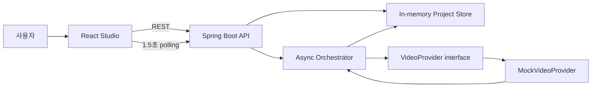

# FIRE 포트폴리오 기록

> 마지막 갱신: 2026-07-22
> 프로젝트: Frame Intelligence Rendering Engine
> 저장소: https://github.com/up-honey/AiAutoMvMaker
> 현재 단계: 과금 없는 Mock 기반 영상 생성 오케스트레이션 MVP

## 1. 프로젝트 소개

FIRE는 하나의 프롬프트로 영상 API를 호출하는 데서 끝나지 않고, 여러 장면의 생성 작업을 비동기로 실행하고 상태와 실패를 추적한 뒤 최종 영상으로 조립하기 위한 AI 영상 제작 파이프라인입니다.

현재 MVP의 목표는 실제 영상 생성 API에 비용을 쓰기 전에 다음 핵심 흐름을 검증하는 것입니다.

```text
영상 기획 입력 → 프로젝트·장면 생성 → 비동기 작업 실행 → 장면별 상태 추적 → 결과 확인
```

## 2. 해결하려는 문제

AI 영상 제작은 장면 수가 늘어나면 단순 API 호출보다 작업 운영이 더 어려워집니다.

- 장면마다 처리 시간과 성공 여부가 다릅니다.
- 일부 장면 실패 때문에 전체 영상을 다시 만들면 시간과 비용이 낭비됩니다.
- 공급자별 API 형식에 서비스 로직이 결합되면 모델 교체가 어렵습니다.
- 서버 재시작, 중복 요청, 외부 API 장애에 대응할 작업 상태 관리가 필요합니다.
- 프롬프트, 모델, 입력 자산, 비용을 추적해야 결과를 재현하고 운영할 수 있습니다.

FIRE는 공급자 연동을 어댑터 뒤로 분리하고, 프로젝트와 장면의 상태 전이를 중심으로 이 문제를 해결하는 방향으로 설계했습니다.

## 3. 기술 스택

| 영역 | 기술 | 적용 내용 |
|---|---|---|
| Backend | Java 21, Spring Boot 4.1, Maven | REST API, 입력 검증, 비동기 작업 실행, 상태 관리 |
| Frontend | React 19, TypeScript 5.9, Vite 8 | 영상 기획 폼, 프로젝트 선택, 진행률 및 장면 상태 UI |
| API | Spring Web MVC, Bean Validation | 구조화된 요청 검증과 오류 응답 |
| Monitoring | Spring Boot Actuator | 애플리케이션 health/info 엔드포인트 |
| Test | JUnit 5, AssertJ | 도메인 상태 전이와 Mock 공급자 성공·실패 검증 |
| Runtime | Docker Compose, Docker, Nginx | API와 정적 웹을 분리한 로컬 실행 구성 |
| Version Control | Git, GitHub | `master` 베이스와 `new` 작업 브랜치 운영 |
| Planned | PostgreSQL, Redis/Queue, Object Storage, FFmpeg, 실제 영상 Provider | 영속화, 작업 복구, 렌더링, 실제 영상 생성으로 확장 예정 |

## 4. 현재 아키텍처



핵심 설계 결정은 다음과 같습니다.

- 실제 공급자와 무관한 `VideoProvider` 계약을 두어 서비스 흐름과 외부 API를 분리했습니다.
- 프로젝트는 `DRAFT → QUEUED → PROCESSING → COMPLETED/FAILED` 상태로 관리합니다.
- 각 장면도 `PENDING → PROCESSING → COMPLETED/FAILED` 상태를 독립적으로 가집니다.
- `MockVideoProvider`는 과금 없이 지연, 성공 결과, 결정적 실패(`[fail]`)를 재현합니다.
- API 오류는 HTTP 상태, 안전한 오류 코드, 메시지, 경로, 시각을 포함하는 구조로 반환합니다.

## 5. 현재 구현 범위

### 구현 완료

- [x] 프로젝트 제목, 주제, 공통 스타일, 화면 비율, 장면 프롬프트 입력
- [x] 한 프로젝트에 최대 12개 장면 등록 및 서버 입력 검증
- [x] 프로젝트 생성·목록·상세 조회 REST API
- [x] 사용 가능한 영상 공급자 목록 API
- [x] Mock 공급자를 이용한 비동기 장면 생성 시작
- [x] 프로젝트와 장면의 상태 전이 및 중복 시작 방지
- [x] 알 수 없는 공급자, 잘못된 입력, 없는 프로젝트, 잘못된 상태의 구조화된 오류 처리
- [x] 공급자 성공 결과의 작업 ID와 미리보기 URI 기록
- [x] 공급자 실패 시 안전한 오류 코드 기록
- [x] 프로젝트 선택, 진행률, 장면별 상태를 보여주는 React UI
- [x] 1.5초 주기 polling을 통한 생성 상태 자동 갱신
- [x] 세로형 `9:16`과 가로형 `16:9` 프로젝트 지원
- [x] Actuator health/info 설정
- [x] API·웹 Dockerfile, Nginx 프록시, Docker Compose 구성
- [x] 도메인 상태 전이 및 Mock 공급자 성공·실패 단위 테스트

### 아직 구현되지 않음

- [ ] Sora, Veo 등 실제 영상 생성 공급자 연결
- [ ] 실제 영상 파일 생성, 다운로드 및 미리보기 재생
- [ ] PostgreSQL 영속화와 서버 재시작 후 작업 복구
- [ ] Redis 또는 메시지 큐 기반 독립 worker
- [ ] 장면별 재시도 API와 부분 재생성
- [ ] 재시도 횟수, timeout, backoff, idempotency key
- [ ] 음성, 배경음, 자막 생성과 FFmpeg 최종 합성
- [ ] 파일/object storage 및 미디어 보존·삭제 정책
- [ ] 사용자 인증·권한과 프로젝트 소유권 검증
- [ ] 공급자별 예상/실제 비용, 사용량 한도, 실행 전 승인
- [ ] 프런트엔드 자동화 테스트와 백엔드 API 통합 테스트
- [ ] CI/CD와 운영 환경 배포

현재 `MockVideoProvider`가 반환하는 `mock://...mp4` 주소는 계약 검증용 참조값이며, 실제 재생 가능한 영상 파일은 아닙니다.

## 6. 제공 API

| Method | Endpoint | 설명 |
|---|---|---|
| `POST` | `/api/projects` | 프로젝트와 장면 생성 |
| `GET` | `/api/projects` | 프로젝트 목록 조회 |
| `GET` | `/api/projects/{projectId}` | 프로젝트 및 장면 상태 조회 |
| `POST` | `/api/projects/{projectId}/generate?provider=mock` | 비동기 생성 시작 |
| `GET` | `/api/providers` | 사용 가능한 공급자 조회 |
| `GET` | `/actuator/health` | 애플리케이션 상태 확인 |

## 7. 검증 결과

2026-07-22 기준 결과입니다.

| 검증 | 결과 | 확인 내용 |
|---|---|---|
| Backend Maven verify | 성공 | 23개 소스 컴파일, JAR 패키징 성공 |
| Backend unit tests | 4/4 성공 | 실패 0, 오류 0, 스킵 0 |
| Frontend production build | 성공 | TypeScript 검사 및 Vite 번들 생성 |
| API smoke test | 성공 | health `UP`, 프로젝트와 장면의 `COMPLETED` 전이 확인 |
| Browser workflow | 성공 | 프로젝트 생성 후 3개 장면이 100% 완료되는 흐름 확인 |
| Browser console | 성공 | 확인 당시 경고·오류 없음 |
| Secret check | 성공 | 회사 이메일, 토큰 패턴, `.env` 커밋 없음 |
| Docker Compose runtime | 미확인 | 이 PC의 Docker Linux engine 기동 문제로 전체 Compose 실행은 별도 확인 필요 |

주요 테스트 시나리오:

- 정상 상태 전이: `DRAFT → QUEUED → PROCESSING → COMPLETED`
- 이미 대기 중인 프로젝트의 중복 시작 거절
- Mock 공급자의 정상 작업 ID와 미리보기 URI 반환
- 프롬프트에 `[fail]`을 넣었을 때 `MOCK_PROVIDER_REJECTED` 실패 재현

## 8. 포트폴리오에서 강조할 내용

### 기술적 강점

- 외부 영상 모델을 직접 서비스 로직에 결합하지 않고 어댑터 패턴으로 교체 가능하게 설계했습니다.
- 비동기 작업을 프로젝트와 장면 단위 상태 머신으로 모델링했습니다.
- 실제 과금 전에 Mock 구현으로 정상·실패 흐름과 UI를 먼저 검증했습니다.
- 생성 작업의 원시 오류나 비밀 값을 노출하지 않고 안전한 오류 코드로 경계를 만들었습니다.
- UI, API, 비동기 오케스트레이터를 하나의 실행 가능한 MVP 흐름으로 연결했습니다.

### 면접에서 설명할 트레이드오프

- MVP 속도를 위해 현재는 in-memory 저장소와 polling을 사용했습니다.
- in-memory 방식은 서버 재시작 시 데이터가 사라지고 다중 인스턴스 운영이 불가능하므로 PostgreSQL과 queue로 교체할 계획입니다.
- polling은 구현이 단순하지만 불필요한 요청이 발생하므로 작업 규모가 커지면 SSE 또는 WebSocket을 검토합니다.
- 현재 실패 후 다시 실행하면 완료된 장면은 건너뛰지만, 실패한 장면의 명시적 재시도 정책과 시도 이력은 아직 없습니다.

## 9. 다음 개발 우선순위

1. PostgreSQL에 프로젝트, 장면, 생성 시도 이력을 영속화합니다.
2. idempotency key와 작업 claim을 추가해 중복 실행과 서버 재시작을 처리합니다.
3. 장면 단위 재시도·부분 재생성 API와 UI를 구현합니다.
4. 실제 영상 공급자 하나를 어댑터로 연결하고 timeout·rate limit·비용 한도를 적용합니다.
5. 생성 자산을 object storage에 저장하고 FFmpeg로 음성·자막·영상을 합성합니다.
6. 통합 테스트, 프런트엔드 테스트, GitHub Actions CI를 추가합니다.
7. 처리 시간, 성공률, 재시도율, 장면당 비용을 대시보드로 시각화합니다.

## 10. 성과 지표

실제 공급자를 연결한 뒤 아래 값을 기능 단위로 기록합니다.

| 지표 | 현재 기준 | 목표 |
|---|---:|---:|
| 자동화 테스트 | Backend 4개 | 핵심 API·실패·복구 시나리오 확대 |
| Mock 장면 처리 지연 | 장면당 약 300ms | 테스트에서 결정적이고 빠른 피드백 유지 |
| 작업 상태 추적 | 프로젝트·장면 2단계 | 생성 시도와 비용 이벤트까지 확장 |
| 서버 재시작 복구율 | 0% | 영속화 이후 100% 목표 |
| 부분 재생성 | 완료 장면 skip 수준 | 명시적 장면 선택과 비용 절감률 측정 |
| 실제 공급자 비용 추적 | 미구현 | 생성 요청 100% 기록 |

## 11. 개발 기록

### 2026-07-22 — 베이스 MVP

- Java/Spring Boot API와 React/TypeScript Studio UI를 구성했습니다.
- 프로젝트·장면 상태 모델과 Mock 영상 공급자 계약을 구현했습니다.
- 비동기 생성 흐름, 진행률 polling, 구조화된 오류 처리를 연결했습니다.
- Docker/Nginx 실행 구성과 아키텍처·보안·작업 규칙 문서를 작성했습니다.
- 백엔드 4개 테스트와 프런트엔드 프로덕션 빌드를 통과했습니다.
- GitHub의 `master`와 `new` 브랜치에 베이스를 구성했습니다.

## 12. 앞으로 기록할 항목

기능을 추가하거나 설계를 바꿀 때 이 문서의 관련 섹션과 개발 기록을 함께 갱신합니다.

- 구현한 문제와 사용자 가치
- 선택한 기술과 다른 선택지 대비 이유
- 변경된 아키텍처, API, 데이터 모델
- 정상·실패·복구 테스트와 실제 결과
- 처리 시간, 성공률, 비용 등 전후 수치
- 해결하기 어려웠던 문제와 해결 과정
- 남아 있는 한계와 다음 우선순위
- 화면, 데모 영상, 배포 주소, PR 링크 등 증빙 자료

개발 기록에는 아래 형식을 사용합니다.

```markdown
### YYYY-MM-DD — 기능명

- 문제:
- 구현:
- 기술적 결정:
- 검증:
- 측정 결과:
- 남은 과제:
- 관련 PR/화면:
```
