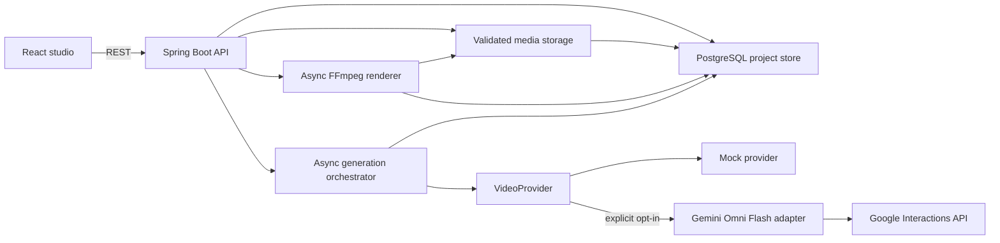
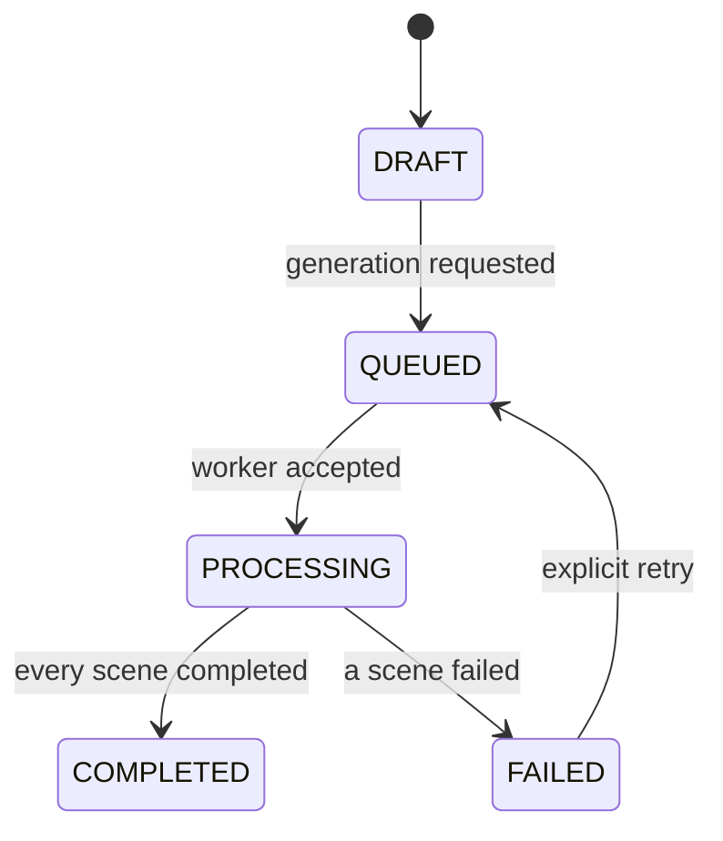

# FIRE architecture

## MVP boundaries

The default path proves job orchestration without spending money on video generation. A conditionally enabled Gemini adapter implements the same asynchronous contract, while paid calls remain behind server configuration and per-request confirmation.

Flyway owns the database schema. Project creation and every project/scene transition are persisted through Spring JDBC. A conditional database update changes only `DRAFT` or `FAILED` projects to `QUEUED`, preventing concurrent duplicate starts.

## Project state

Each scene independently moves through `PENDING`, `PROCESSING`, `COMPLETED`, or `FAILED`. A provider failure is recorded as a safe error code; raw credentials and response payloads are not returned to the UI.

On application startup, projects left in `QUEUED` or `PROCESSING` are loaded from PostgreSQL. Completed scenes remain completed and interrupted scenes return to `PENDING`. If a scene already has a non-terminal provider job id, the orchestrator polls that job instead of submitting and paying for another one.

Final rendering has an independent `QUEUED → PROCESSING → COMPLETED/FAILED` state. Interrupted render rows return to `QUEUED` on startup and rerun idempotently to a generated UUID output key.

## Provider contract

`VideoProvider` receives a normalized command containing the scene prompt, an ordered list of scene image/video metadata, and optional project soundtrack metadata. Each asset reference includes its id, verified content type, size, SHA-256, storage key, timeline position, and display duration. Submission returns a provider job id, which is persisted before polling begins; result polling later returns the preview reference. Provider adapters own API authentication and payload conversion. The orchestrator owns state transitions, retries, budgets, and restart behavior.

The Gemini adapter uses `gemini-omni-flash-preview` through the Interactions API with `background=true`, `store=true`, and URI delivery. Text-only, image-reference, and one-MP4 edit requests are translated inside the adapter. Before reading local inputs it revalidates project ownership, content metadata, size, path containment through the media service, and SHA-256. Completed MP4 bytes are signature checked and atomically published under the project media root.

This separation prevents the product workflow from becoming coupled to one model vendor.

## Persistence design

PostgreSQL stores projects, scenes, ordered input asset metadata, and final render state. Input and output bytes are stored outside the database under generated UUID keys; Docker uses a dedicated persistent volume. The next schema additions are generation attempts and cost events. A separate worker will claim jobs with an idempotency key. Production input and output media will move to object storage, never Git or database blobs.

## Safety decisions

- Real providers are disabled unless explicitly configured.
- Gemini requires both server-side paid generation enablement and per-request user confirmation; Mock remains the default.
- API keys are sent in headers, never query strings, provider payloads, storage metadata, or client responses.
- Generation does not trigger publication or deployment.
- User media must be checked for consent, MIME type, size, and path safety.
- The upload boundary verifies file signatures, size limits, project/scene ownership, and path containment. Inputs are locked once generation starts.
- Original filenames are metadata only. Storage paths use generated ids and every asset records a SHA-256 hash.
- FFmpeg and FFprobe run through fixed `ProcessBuilder` argument lists. User prompts and filenames never become shell or filter expressions.
- Rendering is capped at 300 visual inputs and 30 minutes, writes to a temporary file, then atomically publishes the completed MP4.
- Provider prompts and metadata are auditable; secret values and raw sensitive payloads are not.
- Generated assets require retention and deletion policies before production use.
