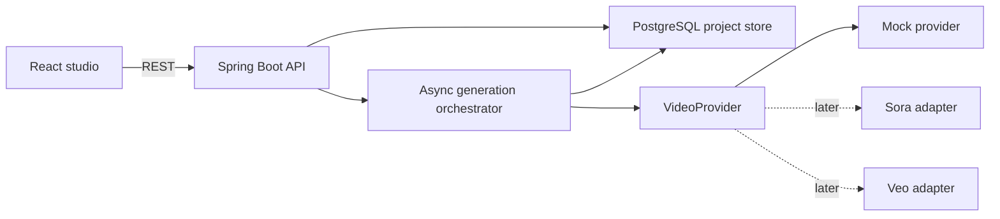
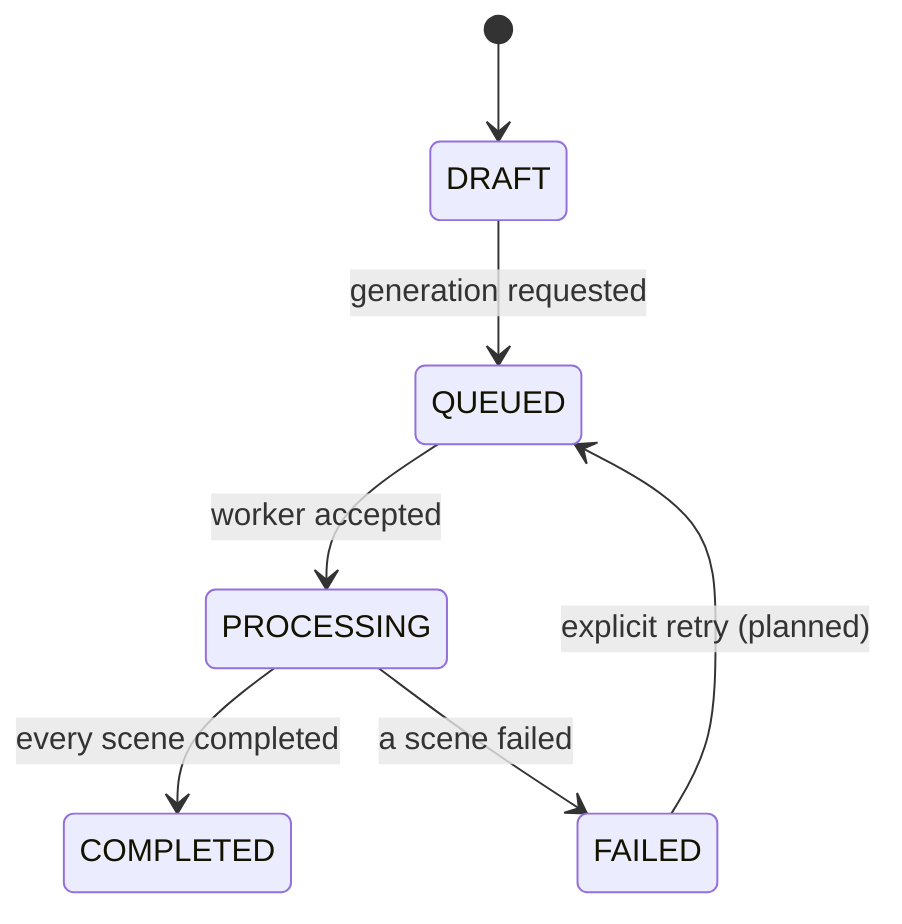

# FIRE architecture

## MVP boundaries

The first version proves job orchestration without spending money on video generation. The mock provider follows the same contract that a real asynchronous provider adapter will use later.

Flyway owns the database schema. Project creation and every project/scene transition are persisted through Spring JDBC. A conditional database update changes only `DRAFT` or `FAILED` projects to `QUEUED`, preventing concurrent duplicate starts.

## Project state

Each scene independently moves through `PENDING`, `PROCESSING`, `COMPLETED`, or `FAILED`. A provider failure is recorded as a safe error code; raw credentials and response payloads are not returned to the UI.

On application startup, projects left in `QUEUED` or `PROCESSING` are loaded from PostgreSQL. Completed scenes remain completed, interrupted scenes return to `PENDING`, and generation resumes with the persisted provider name.

## Provider contract

`VideoProvider` receives a normalized command and returns a provider job id plus a preview reference. Provider adapters own API authentication and payload conversion. The orchestrator owns state transitions, retries, budgets, and idempotency.

This separation prevents the product workflow from becoming coupled to one model vendor.

## Persistence design

PostgreSQL currently stores projects and scenes. The next schema additions are generation attempts, assets, and cost events. A separate worker will claim jobs with an idempotency key. Input and output media will be stored in object storage, never in Git or database blobs.

## Safety decisions

- Real providers are disabled unless explicitly configured.
- Generation does not trigger publication or deployment.
- User media must be checked for consent, MIME type, size, and path safety.
- Provider prompts and metadata are auditable; secret values and raw sensitive payloads are not.
- Generated assets require retention and deletion policies before production use.
